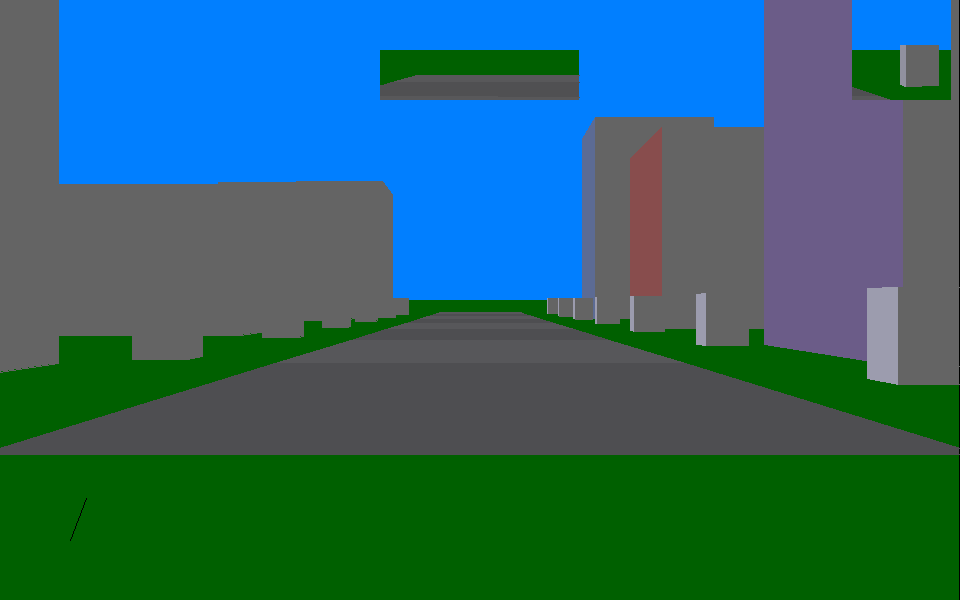
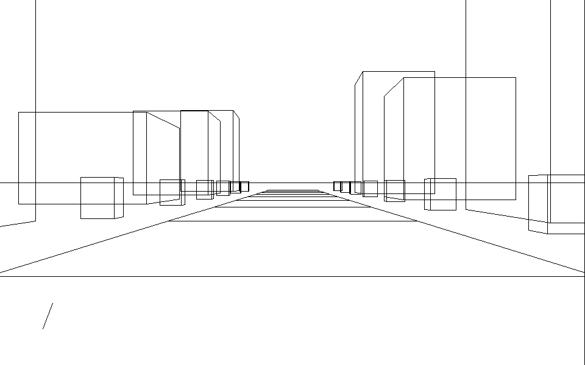
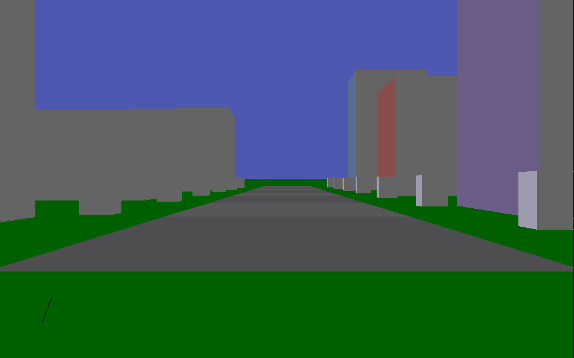
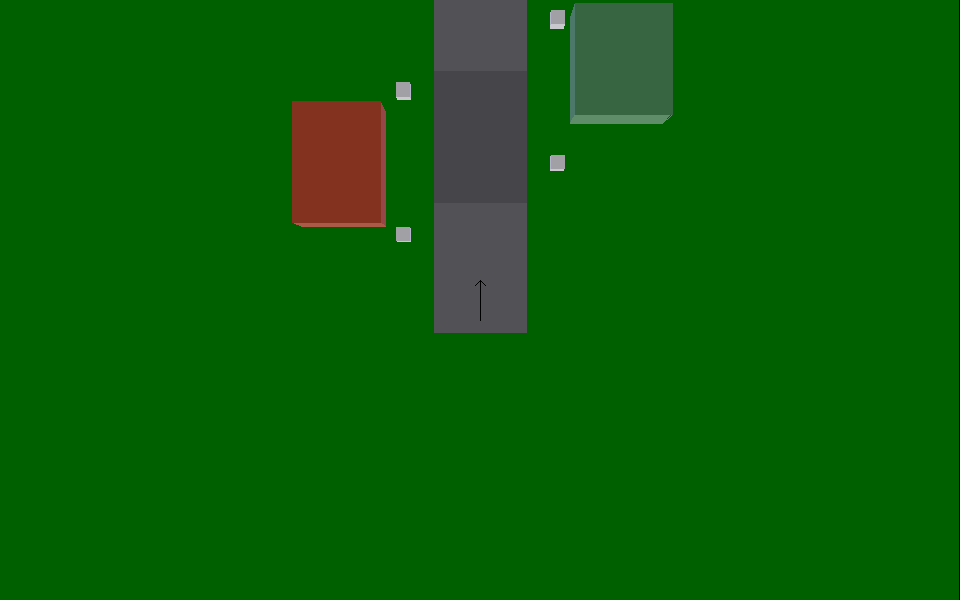

# Virtual Reality Car Simulator

A 3D driving simulator written in 1995 for Windows 3.x, using Borland C++ with
the ObjectWindows Library (OWL) and Microsoft's WinG. It has its own software
renderer: perspective projection, polygon clipping, painter's-algorithm depth
sorting, back-face culling, flat shading with a movable sun, and projected
shadows — all in fixed-function C++ drawing through Win16 GDI.

The original front end was a 16-bit OWL application driving real hardware: a
steering rig read through x86 port I/O at `0x1B0` (`CARAPI.CPP`), with throttle,
clutch, brake, handbrake, gear, wheel position, ignition, and a head-tracking
position for the "virtual reality" part.

This repository builds that engine on a modern toolchain and ships a new viewer,
because the original OWL front end cannot be rebuilt without Borland OWL.



| Wireframe (`--level 1`) | Shadows (`--level 5`) |
| --- | --- |
|  |  |

Overhead map (`--map`), reproducing how `PROJECT.CPP` drew it — camera lifted
straight up, pitched 90°, world counter-rotated by the car's heading:



## Status

| Component | State |
| --- | --- |
| Geometry and rendering engine | Builds and runs |
| `carapi` rig interface | Builds; port I/O is inert off Windows |
| Viewer (X11 window and PNG output) | Builds and runs |
| `PROJECT.EXE` (OWL 1.x simulator) | Needs OWL — skipped by default |
| `CALLDLL.EXE` (OWL 2.x rig test) | Needs OWL — skipped by default |

Nothing in the engine required rewriting; only the platform around it was
replaced. See [Porting notes](#porting-notes).

## Requirements

- CMake 3.16+ and a C++ compiler
- libpng — for the viewer's PNG output
- libX11 — optional; without it the viewer still builds in PNG-only mode

On Debian or Ubuntu:

```bash
sudo apt install cmake g++ libpng-dev libx11-dev
```

## Build

```bash
cmake -S . -B build -DCMAKE_BUILD_TYPE=RelWithDebInfo
cmake --build build
ctest --test-dir build          # CMake 3.20+; older: cd build && ctest
```

Configuration prints what it decided:

```
-- NEWI / VirtualRealityCarSimulatorEngine
--   Win16 compat  : TRUE
--   OWL available : FALSE
--   viewer        : X11 window + PNG
```

## Run

```bash
./build/newi_viewer                                  # interactive window
./build/newi_viewer --png frame --frames 8 --level 5 # render to PNG
./build/newi_viewer --map --zoom 4000                # overhead map
```

### Controls

| Key | Action |
| --- | --- |
| Arrow up / down | Accelerate / brake |
| Arrow left / right | Steer |
| `1`–`5` | Detail level |
| `M` | Toggle overhead map |
| `+` / `-` | Map zoom (altitude 1000–9000) |
| `V` | Toggle back and right mirrors |
| `P` | Save a screenshot |
| `Q` / `Esc` | Quit |

### Options

| Option | Meaning |
| --- | --- |
| `--png PREFIX` | Render frames to `PREFIX_000.png` and exit |
| `--frames N` | Frame count in PNG mode (default 6) |
| `--width` / `--height` | Framebuffer size (default 960×600) |
| `--level 1..5` | Detail level |
| `--map` | Overhead map view |
| `--zoom N` | Map altitude, 1000–9000 |
| `--mirrors` | Overlay the back and right mirrors |
| `--headless` | Never open a window |

### Detail levels

These are the engine's own five rendering modes, selected by `MyView`'s
`aGraphicLevel` argument and dispatched in `MyFace::Draw`:

| Level | Mode |
| --- | --- |
| 1 | Wireframe, back faces culled |
| 2 | Filled with the default brush |
| 3 | Flat colour per face |
| 4 | Flat colour lit by the sun |
| 5 | As 4, plus projected shadows |

Levels 3 and above also paint the sky and ground; 1 and 2 draw on white, as
they did in 1995.

## Layout

```
VirtualRealityCarSimulatorEngine/   original 1995 sources, 8.3 DOS filenames
compat/
  newi_borland_prelude.h            erases far/pascal/_export keywords
  win16/                            Win16 headers and two GDI back ends
  tests/engine_smoke.cpp            headless engine test
viewer/                             the new front end and its demo scene
docs/                               screenshots
```

The engine proper is `TRIPLET`, `TRIANGLE`, `FACE`, `MYOBJECT`, `LIST`, `VIEW`,
`MYCLIP` and `DASHBOAR`. `PROJECT.CPP` is the OWL application, `CALLDLL.CPP` an
OWL rig test harness, and `CARAPI.CPP` the hardware interface. `WING.H` is
Microsoft's 1994 WinG header, kept as found.

## CMake targets

| Target | Kind | Notes |
| --- | --- | --- |
| `vr_engine` | static lib | The 1995 renderer. Links no GDI back end itself |
| `win16_capture` | static lib | GDI that counts draw calls, for tests |
| `win16_raster` | static lib | GDI that fills pixels, for the viewer |
| `carapi` | lib | Rig interface; shared on Windows, static elsewhere |
| `newi_viewer` | executable | The viewer |
| `engine_smoke` | executable | Headless test, registered with CTest |

`vr_engine` deliberately links neither GDI back end, so each executable chooses
one. Linking both into the same binary would be a duplicate-symbol error.

| Option | Default | Meaning |
| --- | --- | --- |
| `BUILD_ENGINE_LIB` | ON | Build the renderer |
| `BUILD_CARAPI` | ON | Build the rig interface |
| `BUILD_TESTS` | ON | Build `engine_smoke` |
| `BUILD_VIEWER` | ON | Build the viewer (needs libpng) |

## Building the original OWL applications

`PROJECT.EXE` and `CALLDLL.EXE` need Borland OWL, which is not redistributable
and is not in this repository. Point CMake at an OWL installation — original
Borland OWL, or the community-maintained
[OWLNext](https://sourceforge.net/p/owlnext/wiki/) — and they are added to the
build:

```bash
cmake -S . -B build \
  -DOWL_INCLUDE_DIR=/path/to/owl/include \
  -DOWL_LIBRARY=/path/to/owl.lib \
  -DWING_LIBRARY=/path/to/wing32.lib
```

Without OWL they are skipped rather than failing the build. A Windows toolchain
is required either way; `PROJECT.CPP` uses OWL 1.x dispatch syntax
(`virtual void Foo(RTMessage) = [CM_FIRST + IDM_X]`) that only Borland's
compiler accepts, so expect to port that file even with OWL present.

Note that OWLNext only distributes *patches* to OWL, under the MIT licence. OWL
itself remains proprietary and owned by Embarcadero, so a separate OWL licence
is required.

## Porting notes

The renderer's logic is untouched. What changed was everything underneath it.

**Filename case.** Every local `#include` disagreed in case with the file on
disk (`"Triplet.h"` vs `TRIPLET.H`), and some carried the embedded spaces of 8.3
names (`#include "view    .h"`). DOS did not care; case-sensitive filesystems
do. All now match the real filenames.

**Pre-standard C++.** `FACE.CPP` reuses a `for`-scoped loop counter after its
loop, legal in 1995 and an error since C++98; the declarations were hoisted.
`MYCLIP.H` had no include guard and declared `typedef struct Poly {...};` with
no declarator.

**The missing platform.** `compat/` supplies what Borland used to: a `windows.h`
covering the Win16 GDI subset the engine calls, plus `alloc.h`, `conio.h` and
`bwcc.h`. A force-included prelude erases `far`, `pascal` and `_export`, which
appear in headers that include nothing and so cannot be fixed with an `#include`.
Note `MoveTo` — Win32 replaced it with `MoveToEx`, so even a real Windows build
needs that shim.

**Two GDI back ends.** `win16_capture` records draw calls, letting the test
assert that projection, clipping and hidden-surface removal emit the geometry
they should, with no display. `win16_raster` implements the same API for real
with scanline polygon fill and clipped Bresenham lines. Both clip analytically
in floating point before touching pixels, because the engine legitimately emits
coordinates near ±100000 — a road edge 1000 units wide at 10 units of depth
really does project that far. `VIEW.CPP` also deletes its clip region while it
is still selected into the DC, so the rasteriser copies the rectangle instead of
retaining the pointer, as real GDI does.

**The viewer is not a port of `PROJECT.EXE`.** It calls the same `MyView()` that
`PROJECT.EXE`'s `Paint` handler called, with the same arguments, into a memory
framebuffer. The scene is generated procedurally: the original loaded `.CGW`
files through `ReadWorld()`, and none are in this repository.

### Bugs fixed

Long-standing defects in the 1995 code, all found while getting it to build and
run:

| Where | Bug |
| --- | --- |
| `LIST.CPP`, `MYOBJECT.CPP` (×3) | `free(&OldHead)` freed the address of a stack variable instead of the heap block — heap corruption on every list deletion |
| `LIST.CPP DeleteTail()` | Walked to the last cell then called `free(Current->Next)`, always `NULL`. Freed nothing and never unlinked the tail |
| `MYCLIP.CPP ClipPoly()` | `for (Side=CLIPTOP; Side<=CLIPTOP; ...)` ran once, so three of the four clip edges were dead code |
| `MYCLIP.CPP ClipOne()` | Read `Verts[-1]` when handed an empty polygon, reachable once all four clip edges work |
| `FACE.CPP` | `i<=ClipFace.NumVert` read and wrote one vertex past the count |
| `VIEW.H` | Declared `SpeedoMeter(...,short,short)` while `VIEW.CPP` defines the last parameter as `long int`, so the declared function never existed and any caller failed to link |
| `PROJECT.CPP ReadWorld()` | `P[CptPts++]` then `AddPoint(&P[CptPts])` registered the next, unwritten vertex slot |

### Known remaining bugs

In `PROJECT.CPP`'s `ReadWorld()`, which cannot be compiled here without OWL and
so has been left alone:

```cpp
is>>TempPts[0];
while(TempPts[0]!=9999)      // tests [0], which never changes again
{
  is>>TempPts[++lCtr];       // unbounded write into int TempPts[4]
}
```

The condition never re-reads, so unless a face's first vertex index happens to
be the `9999` sentinel this spins forever writing past the end of a 4-element
stack array. In the same function, `DebPts` is captured after the object's
vertices have been counted, so face indices are offset past its own points, and
the per-face `lr, lg, lb` colours are parsed and then discarded because
`SetColor` is never called.

## Development

```bash
# warnings, tests
cmake -S . -B build -DCMAKE_BUILD_TYPE=Debug
cmake --build build
(cd build && ctest --output-on-failure)

# sanitizers
cmake -S . -B build-asan -DCMAKE_BUILD_TYPE=Debug \
  -DCMAKE_CXX_FLAGS="-fsanitize=address,undefined -g"
cmake --build build-asan
ASAN_OPTIONS=detect_leaks=0 ./build-asan/engine_smoke
```

Leak detection is left off above because the 1995 containers never free their
cells — `OList::~OList` and `MyObject::~MyObject` are both empty. That is
original behaviour and has not been changed.
